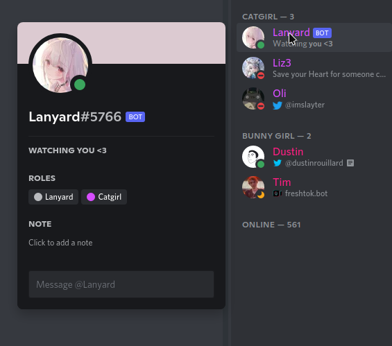
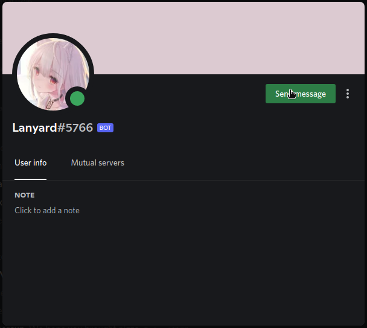
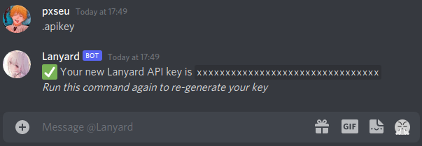

# Lanyard UI

> Simple UI to easily access kv and visualize your Discord User / Status with Lanyard

## Before you start

1. Make sure you've joined the [Lanyard Discord server](https://discord.gg/UrXF2cfJ7F)
1. If you want to use the KV editor make sure to get your [Api Token](#token)
1. Find your Discord User ID

## Token

> How do I get my Lanyard Token / Api Key?

1. Open direct messages with the Lanyard bot \
    \
   
1. Send a message with the following content: `.apikey` \
   
1. Copy the token to a safe place

## Running Locally

You can use these to run the tests:

```sh
$ npm ci
$ npm test
```

or with yarn

```sh
# if you already installed once make sure to remove node_modules
$ yarn install --frozen-lockfile
$ yarn test
```

## Contributing

1.  Fork the repo on GitHub
1.  Clone the project to your own machine
1.  Commit changes to your own branch
1.  Push your work to your fork
1.  Submit a Pull request so that I can review your changes

NOTE: Be sure to merge the latest from "upstream" before making a pull request!

## License

Copyright 2021 pxseu

Licensed under the Mozilla Public License, Version 2.0 (the "License"); you may not use this file except in compliance with the License. \
You may obtain a copy of the License at:

> https://www.mozilla.org/en-US/MPL/2.0/

A copy of the license is available in the repository's [LICENSE](./LICENSE) file.
