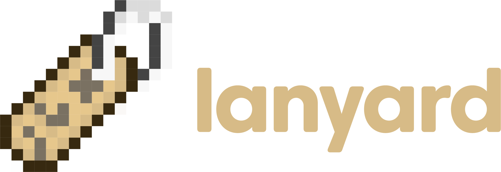
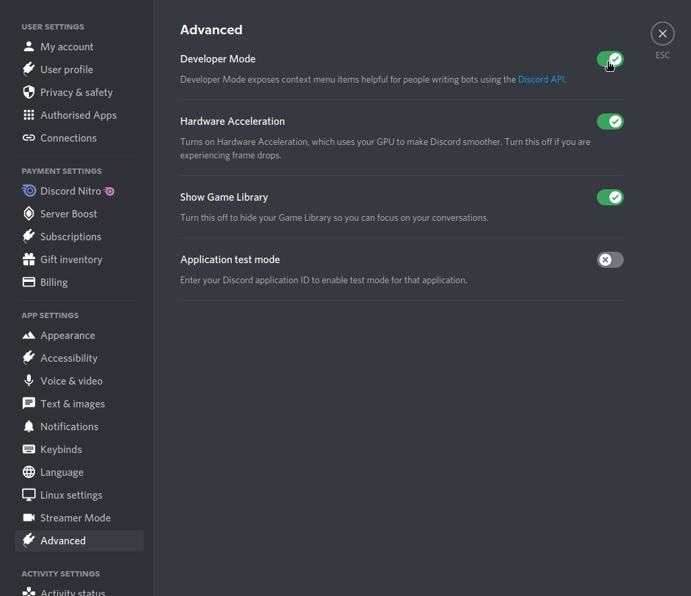
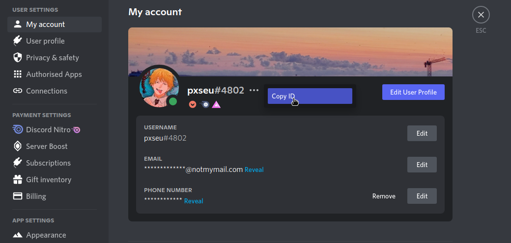
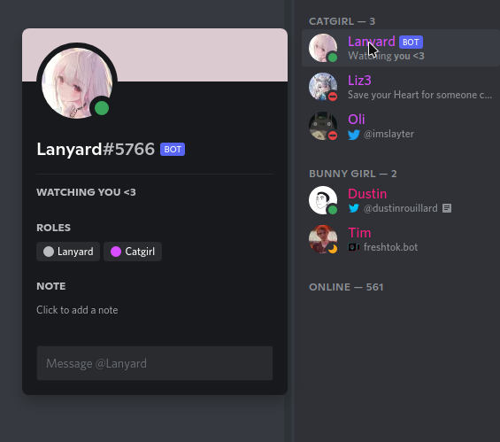
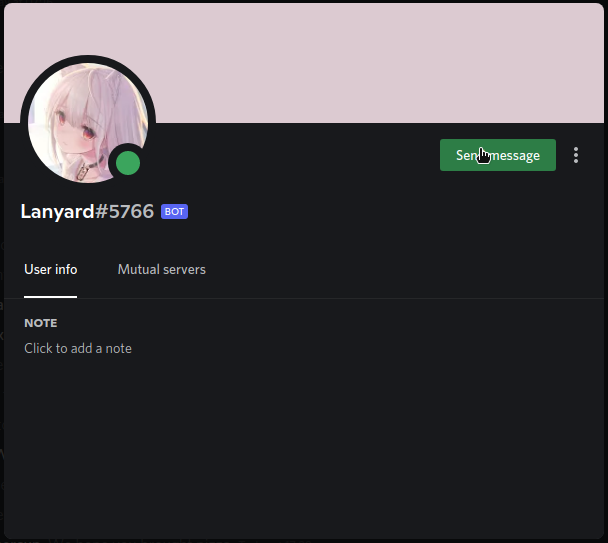
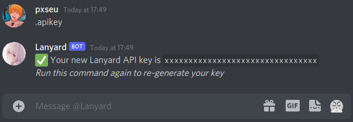

# Lanyard UI

> Simple UI to easily access kv and visualize your Discord User / Status with Lanyard

Huge thanks to [@Phineas](https://github.com/phineas) for making this possible with [his amazing project](https://github.com/phineas/lanyard)!

## Before you start

1. Make sure you've joined the [Lanyard Discord server](https://discord.gg/UrXF2cfJ7F)
1. If you want to use the KV editor make sure to get your [Api Token](#token)
1. Find your [Discord User ID](#user-id)

## User ID

1. Open settings got to the `Advanced` tab and turn on `Developer Mode` \
   
1. Still in settings go to `My Account` and click the three dots and copy your ID \
   

## Token

> How do I get my Lanyard Token / Api Key?

1. Open direct messages with the Lanyard bot \
    \
   
1. Send a message with the following content: `.apikey` \
   
1. Copy the token to a safe place

## Running Locally

This project uses [Bun](https://bun.sh) as the package manager and [Vite](https://vitejs.dev) as the build tool.

```sh
# Install dependencies
$ bun install

# Start development server
$ bun run dev

# Run static checks
$ bun run typecheck

# Build for production
$ bun run build

# Run the full local verification pass
$ bun run check

# Preview production build
$ bun run preview
```

## Features

- 🚀 Built with Vite for lightning-fast development
- ⚛️ React 18 with modern hooks and patterns
- 🎨 Styled Components for beautiful, maintainable styling
- 🔄 Real-time Discord presence updates
- 🔑 KV store editor with validation
- 🎭 Support for Discord decorations and custom statuses
- 📱 Responsive design

## Contributing

1. Fork the repo on GitHub
1. Clone the project to your own machine
1. Commit changes to your own branch
1. Push your work to your fork
1. Submit a Pull request so that I can review your changes

NOTE: Be sure to merge the latest from "upstream" before making a pull request!

## License

Copyright 2021 pxseu

Licensed under the Mozilla Public License, Version 2.0 (the "License"); you may not use this file except in compliance with the License. \
You may obtain a copy of the License at:

> https://www.mozilla.org/en-US/MPL/2.0/

A copy of the license is available in the repository's [LICENSE](./LICENSE) file.
